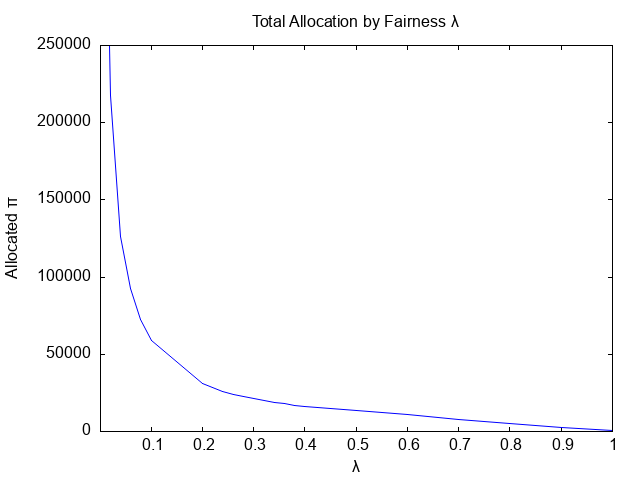

## 4 Allocation Period

This section describes an **optimal fairness** allocation option. It will
provide maximal allocations that satiisfy commitment constraints while
optimizing fairness. Note that this option does not deal with liquidity or
engagement rewards.

The allocation process is one of multiple objective functions. In this case,
maximizing the total allocation measured in $\pi$ and maximizing the
dimensionless measure of fairness. To solve this problem, a blending term,
$\lambda$ was introduced to transition from full focus on allocation
($\lambda=0$) to full focus on fairness ($\lambda=1$). Quadratic programming was selected
as the optimization mechanism. The graph below report allocations tha
maximized the combined objective function while maintaining the allocation
constraints from the participants commitment. Details of the process are
described below. The following graph summarizes the different allocations
for a range of $\lambda$s. The allocation only point is not plotted, as
$5,385,464$ is significantly larger than the rest of the values.

  

**Notation:**
- $s_i$ is the stake of an participant representing their desire to purchase project tokens
- $S$ is the combined stakes of all participant ($\sum_i s_i$)
- $c_i$ is the Pi commitment of a participent
- $C$ = total Pi committed by participants to purchase tokens of a project  ($\sum_i c_i$)
- $a_i$ is the allocation of tokens to a participent
- $A$ is the total allocation of tokens ($\sum_i a_i$)

### Fairness

In this design option, we define a fair allocation to be one where a
participant recieves an allocation rate equal to their stake rate. The
stake rate is $s_i/S$ and the allocation rate is $a_i/A$. Therefore, a
fair allocaiton occurss when

$$s_i/S = a_i/A$$

We can convert this constraint into a fairness measure across all participents.

$$ F = \sum_i -(s_i/S - a_i/A)^2 $$

Fairness is negated so we can talk about maximizing fairness, as unfair allocations will be negative.

With this definition we can establish the following optimization problme

Find $\forall_i a_i$\
maximizing $A$ and $F$\
under the constraints $\forall_i 0 < a_i \le c_i$

With this formulation, it is possible to find satisfactory allocations using
quadratic programming.

Given the two optimization objectives described above, it is impossible to
provide a single optimizing assignment. What we can do, however, is provide a Pareto
frontier of optimal solutions for a given blending factor, $\lambda$. This
factor will range from zero for no fairness, to one for nothing but fairness.
A value of one half will balance the two objective functions. The leaves us
with a new optimization problem

Find $\forall_i a_i$\
maximizing $(1 - \lambda) A + \lambda F$\
under the constraints $\forall_i 0 < a_i \le c_i$

Our optimization system will take a list of stakes and commitments from
participants and produce a set of allocations for $\lambda \in {0, 0.25, 0.5,
0.75, 1.0}$

## Special Cases
### Commitment driven ($\lambda=0$)

When $\lambda$ is zero, the optimization will maximize only $A$. The assignment
solution in this case is simply apply the commitment. This case yields the
largest total assignment.

### Fairness driven ($\lambda=1$)
When $\lambda$ is one, the optimization will maximize only $F$. The assignment
solution in this case is to find the smalles $c_i S / s_i$ across participents.
Using this assignment cap, it is possible to make assignments with maximal
fairness across the pool. This case yields the smallest total assignment.

Due to this behavior, it will be usefull to remove small commitments from
the data set before processing.

## Application

The process described above was applied to the participant data in
`launchpad_user_stake_commit_totals.csv`. All commitments strictly less than
1 Pi were excluded from analysis. That reduced participants from 76046 to
74599.

The reference implementation is `sample/make_assignments.rb`: it writes
`assignments.csv` and prints a per-$\lambda$ summary on standard output.

### Standard output (summary table)

After each run, a table like the following is printed (column **total_assignment**
is rounded to a whole number; **fairness_F**, **avg_fairness**, and
**std_fairness** use five significant figures).

| lambda | total_assignment | fairness_F | avg_fairness | std_fairness |
|--------|------------------|------------|--------------|--------------|
| 0.00 | 5385464 | -0.0028664 | -3.8424e-08 | 0.00019602 |
| 0.25 | 25144 | -4.513e-05 | -6.0497e-10 | 2.4596e-05 |
| 0.50 | 13367 | -2.8334e-05 | -3.7982e-10 | 1.9489e-05 |
| 0.75 | 6367 | -2.4247e-05 | -3.2503e-10 | 1.8029e-05 |
| 1.00 | 373 | -8.0617e-35 | -1.0807e-39 | 3.2874e-20 |

| Column | Meaning |
|--------|---------|
| **lambda** | Blending parameter $\lambda \in \{0, 0.25, 0.5, 0.75, 1.0\}$. |
| **total_assignment** | $A = \sum_i a_i$ for that run (integer display). |
| **fairness_F** | $F = \sum_i -(s_i/S - a_i/A)^2$. |
| **avg_fairness** | $F/n$ where $n$ is the number of participants after the commit cutoff. |
| **std_fairness** | $\sqrt{\lvert F/n\rvert}$ (same spirit as standard deviation vs variance). |

*Context: $n = 74599$ participants; $F$ uses the formula above.*

### File `assignments.csv`

One row per included participant. Columns are the **original** CSV headers (in
order), followed by one numeric column per $\lambda$:

| Column | Meaning |
|--------|---------|
| `user_id` | Participant id (from input). |
| `total_staked_amount` | Stake $s_i$. |
| `total_commit_amount` | Commitment $c_i$. |
| `assignment_lambda_0.00` | $a_i$ when $\lambda=0$. |
| `assignment_lambda_0.25` | $a_i$ when $\lambda=0.25$. |
| `assignment_lambda_0.50` | $a_i$ when $\lambda=0.5$. |
| `assignment_lambda_0.75` | $a_i$ when $\lambda=0.75$. |
| `assignment_lambda_1.00` | $a_i$ when $\lambda=1$. |

If the input contains additional columns before the assignments, they are
preserved in order between the stake/commit fields and the
`assignment_lambda_*` columns.

### Longitudinal study

The data reported below examine the $\lambda$ space in greater detail. Again
there is a large drop in total assignment once a small amount of fairness is
considered. Most striking is the spike at $\lambda = 0.3$: the 109k total
assignment is about five times what would be expected from linear interpolation.
While that might look encouraging, it resulted from an incomplete optimization
attempt.

#### Coarse grid ($\lambda = 0.0,\, 0.1,\, \ldots,\, 1.0$)

| lambda | total_assignment | fairness_F | avg_fairness | std_fairness |
|--------|------------------|------------|--------------|--------------|
| 0.00 | 5385464 | -0.0028664 | -3.8424e-08 | 0.00019602 |
| 0.10 | 59237 | -6.6342e-05 | -8.8931e-10 | 2.9821e-05 |
| 0.20 | 30883 | -5.0975e-05 | -6.8332e-10 | 2.614e-05 |
| 0.30 | 109746 | -2.6531e-07 | -3.5565e-12 | 1.8859e-06 |
| 0.40 | 16364 | -3.2876e-05 | -4.4071e-10 | 2.0993e-05 |
| 0.50 | 13367 | -2.8333e-05 | -3.7981e-10 | 1.9489e-05 |
| 0.60 | 11324 | -2.6204e-05 | -3.5126e-10 | 1.8742e-05 |
| 0.70 | 8017 | -2.5075e-05 | -3.3613e-10 | 1.8334e-05 |
| 0.80 | 4922 | -2.3176e-05 | -3.1067e-10 | 1.7626e-05 |
| 0.90 | 2426 | -1.9147e-05 | -2.5666e-10 | 1.6021e-05 |
| 1.00 | 373 | -8.0617e-35 | -1.0807e-39 | 3.2874e-20 |

*Context: $n = 74599$ participants; $F = \sum_i -(s_i/S - a_i/A)^2$; $\text{std\_fairness} = \sqrt{\lvert F/n\rvert}$ (analogous to standard deviation vs variance).*

Additional runs provide more visibility into the effect of $\lambda$ on total
assignment.

#### Refined grid ($\lambda \in \{0.02, 0.04, 0.06, 0.08\} \cup \{0.22, 0.24, \ldots, 0.38\}$)

| lambda | total_assignment | fairness_F | avg_fairness | std_fairness |
|--------|------------------|------------|--------------|--------------|
| 0.02 | 217815 | -9.7815e-05 | -1.3112e-09 | 3.6211e-05 |
| 0.04 | 126221 | -8.1977e-05 | -1.0989e-09 | 3.315e-05 |
| 0.06 | 92574 | -7.4899e-05 | -1.004e-09 | 3.1686e-05 |
| 0.08 | 72229 | -7.0063e-05 | -9.392e-10 | 3.0646e-05 |
| 0.22 | 28275 | -4.8505e-05 | -6.5022e-10 | 2.5499e-05 |
| 0.24 | 26102 | -4.6213e-05 | -6.1949e-10 | 2.4889e-05 |
| 0.26 | 24254 | -4.4081e-05 | -5.9091e-10 | 2.4309e-05 |
| 0.28 | 22658 | -4.2089e-05 | -5.6421e-10 | 2.3753e-05 |
| 0.32 | 95358 | -3.1316e-07 | -4.1979e-12 | 2.0489e-06 |
| 0.34 | 18968 | -3.692e-05 | -4.9491e-10 | 2.2247e-05 |
| 0.36 | 18004 | -3.5455e-05 | -4.7528e-10 | 2.1801e-05 |
| 0.38 | 17141 | -3.4105e-05 | -4.5717e-10 | 2.1382e-05 |

*Context: same $n$, $F$, and std_fairness definitions as above.*

These runs—with the incomplete solves at $\lambda \in \{0.30, 0.32\}$ treated as outliers—are reflected in the accompanying figure.
