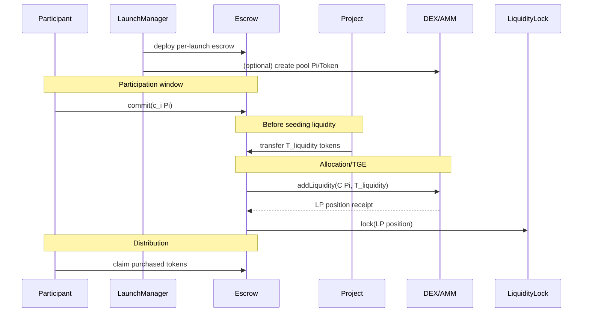

# 03 — Contract architecture (PiRC ↔ smart contracts ↔ DEX)

This chapter defines a reference architecture: a set of contracts (or contract-like onchain programs) that enforce PiRC and integrate with a DEX/AMM.

You can implement this on:

- an EVM chain (Solidity),
- Stellar Soroban (Rust),
- or another smart contract platform.

The *concepts* are chain-agnostic; the interfaces change.

---

## 1) Components and responsibilities

### A. `ProjectRegistry` (optional but useful)

Purpose: represent “approved projects can launch tokens” onchain.

Stores:

- `projectId` (string/bytes32)
- `owner` (address)
- `status` (pending / approved / rejected)
- `appUrl` (optional)

Key functions:

- `registerProject(projectId, appUrl)`
- `setStatus(projectId, status)` (governance/admin)
- `ownerOf(projectId)`

If you keep project approval offchain (as your current backend does), you can omit this contract and instead store project ownership in the launch contract at creation time.

---

### B. `LaunchManager`

Purpose: lifecycle owner for a launch (state machine + parameters).

Stores per launch:

- phase/state (participation open/closed, etc.)
- token address (or asset identifiers)
- DEX pool identifier
- escrow address
- economic parameters:
  - \(T_{purchase}\), \(T_{liquidity}\), optional \(T_{engage}\)
  - commitment window start/end timestamps
  - listing rules (e.g. Design 1: \(p_{list}=\frac{C}{T}\) when \(T_{purchase}=T_{liquidity}=T\))

Key functions:

- `createLaunch(params)` (only approved project owner or platform)
- `openParticipation(launchId)`
- `closeParticipation(launchId)`
- `finalizeAllocation(launchId, data)` (onchain or verified from a root)
- `openTge(launchId)` (often after LP seeding)

---

### C. `Escrow` (per launch)

Purpose: custody participant commitments and coordinate LP seeding + distribution.

Stores:

- total committed Pi \(C\)
- per-user commitment \(c_i\) (or a merkle root to commitments)
- token buckets to distribute

Key functions:

- `commit(piAmount)` (only during participation window)
- `seedLiquidity()` (after participation closes)
- `claimPurchasedTokens()` (after finalization)

Critical rule: `Escrow` must **never** transfer committed Pi to the project.

---

### D. `LiquidityLock`

Purpose: make PiRC’s “initial liquidity cannot be rugged” an invariant.

Stores:

- the LP position (LP shares, LP NFT, or pool deposit receipt)

Key functions:

- `lock(position)`
- `withdraw(...)`:
  - either **not implemented** (permanent lock), or
  - only allows withdrawing fees, not principal, or
  - time-delayed governance withdraw (weaker than permanent lock)

---

### E. `Vesting` (team + treasury allocations)

Purpose: make unlock schedules enforceable and transparent.

Stores:

- vesting schedule parameters (\(t_0, t_1\), cliff, beneficiaries)
- allocated amounts
- amount claimed so far

Key functions:

- `claim()` (beneficiary)

---

### F. DEX / AMM contracts

Purpose: provide pool creation, swapping, and liquidity mechanics.

You generally integrate with:

- `PoolFactory` (create pool)
- `Pool` (reserves + swaps)
- `Router` (swap routing + add/remove liquidity helpers)

For constant product AMMs, the invariant is:

\[
x\cdot y = k
\]

Where:

- \(x\) = Pi reserve in the pool
- \(y\) = token reserve in the pool

We’ll use this in the AMM math chapter.

---

## 2) Data flow (PiRC Design 1)

---

## 3) What *must* be onchain vs “can be offchain”

For a PiRC-aligned system:

- **Must be onchain**
  - commitment custody
  - liquidity seeding
  - liquidity lock
  - claim/distribution mechanics

- **Can be offchain (with onchain verification if it affects money)**
  - engagement scoring
  - participant ranking
  - analytics, dashboards

A common hybrid approach is:

- compute engagement tiers offchain,
- publish a merkle root onchain,
- users prove their tier/bonus in `claim()`.

---

## 4) Mapping to this repo’s current model (high level)

Your current system (from existing docs) uses a **single custody account** and a DB ledger for positions and launch state.

When migrating toward smart contracts:

- “custody account holds funds” ⇒ “escrow contract holds funds”
- “backend signs transfers” ⇒ “contract enforces transfers”
- “DB is the ledger” ⇒ “events are the ledger, DB indexes events”

Chapter 09 goes deeper on a migration path that keeps you shipping.

